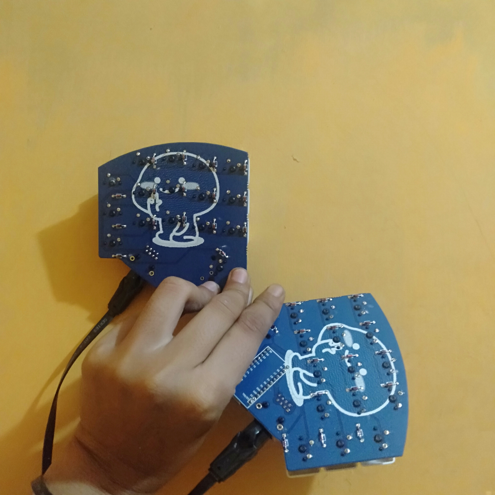

# Weirdo

It's a split keyboard that uses 1 Promicro (or its clone) and RJ45.

## Why?

Just because

## Does It Work?

Of course it works.

## Firmware?

It uses [QMK](https://qmk.fm) as the firmware.

## Keymaps?

Default: [default](https://github.com/ibnuda/qmk_firmware/tree/weirdo/keyboards/weirdo/keymaps/default)

[Denny Tom's Chording Engine](https://github.com/qmk/qmk_firmware/tree/master/users/dennytom/chording_engine):
[rick's combo](https://github.com/ibnuda/qmk_firmware/tree/weirdo/keyboards/weirdo/keymaps/rick-combo)

## License

GPLv3
